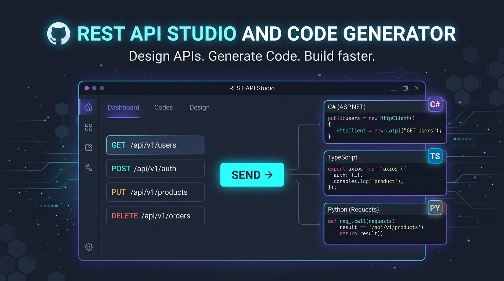
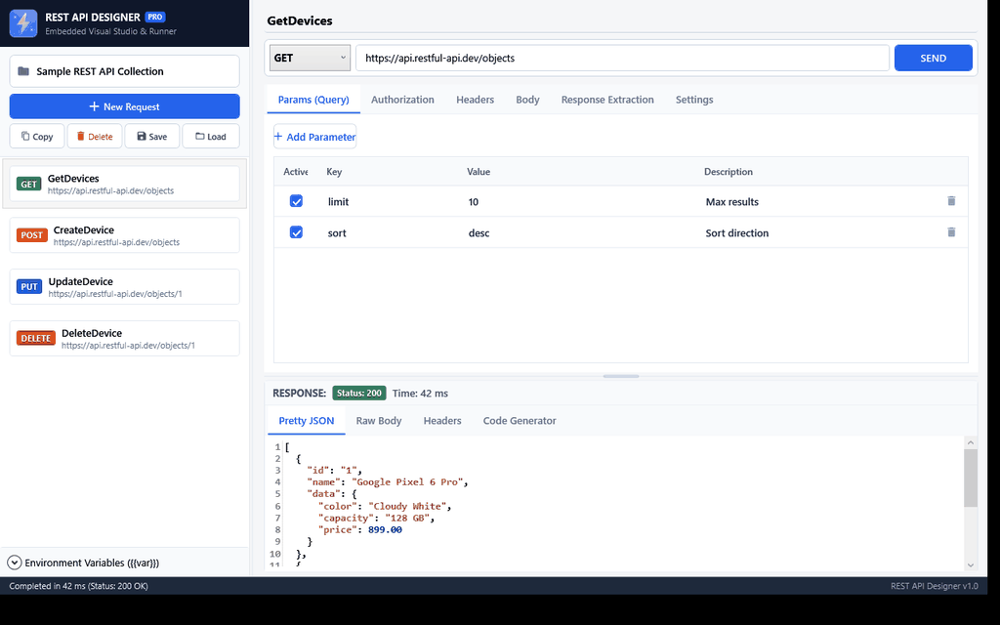
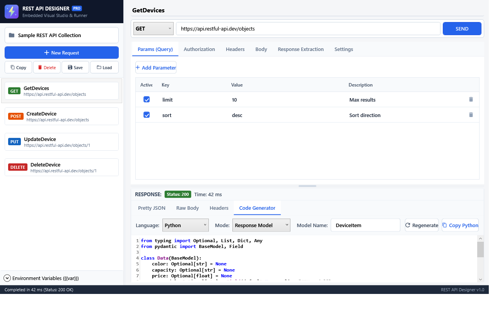

# REST API Designer & Integrated Execution Library (`API_Integarated`)

[ 🇬🇧 English ](README.md) • [ 🇻🇳 Tiếng Việt ](README_VN.md)

<p align="center">
  
</p>

> A **UI-First** REST API designer, interactive testing, and execution library built for .NET and C# applications.  
> Eliminates boilerplate HTTP code (`HttpClient`, manual URL concatenation, header injection, token management, body serialization, SSL bypass, JSON parsing) across all your projects.

---

## 🎬 Interactive Workflow Demo

<p align="center">
  
</p>

---

## 📑 Table of Contents
1. [Overview & Core Benefits](#-overview--core-benefits)
2. [Project & Folder Architecture](#-project--folder-architecture)
3. [UI Studio User Guide](#-ui-studio-user-guide)
   - [3.1. Launching the Studio](#31-launching-the-studio)
   - [3.2. Creating & Configuring Requests](#32-creating--configuring-requests)
   - [3.3. Authentication Configuration](#33-authentication-configuration)
   - [3.4. Request Body Editor](#34-request-body-editor)
   - [3.5. Real-Time Test Runner](#35-real-time-test-runner)
   - [3.6. Automated Code & Model Generation (C#, TypeScript, Python)](#36-automated-code--model-generation-c-typescript-python)
   - [3.7. Saving & Loading Collections (.json)](#37-saving--loading-collections-json)
4. [Integration Guide for External Projects](#-integration-guide-for-external-projects)
   - [Method 1: High-Level ApiClient with C# Models (Recommended)](#method-1-high-level-apiclient-with-c-models-recommended)
   - [Method 2: Dynamic Execution (Dynamic / JsonNode – No Classes Needed)](#method-2-dynamic-execution-dynamic--jsonnode--no-classes-needed)
   - [Method 3: Direct UI Embedding in WPF Apps (e.g., R-Link)](#method-3-direct-ui-embedding-in-wpf-apps-eg-r-link)
5. [Environment & Dynamic System Variables](#-environment--dynamic-system-variables)
6. [Automated Testing (Unit Tests)](#-automated-testing-unit-tests)
7. [License & Credits](#-license--credits)

---

## 🌟 Overview & Core Benefits

### Traditional Manual Workflow vs `API_Integarated`

```text
BEFORE (Manual & Tedious):
[Read API Docs] -> [Test in Postman] -> [Write dozens of HttpClient C# lines] -> [Handcraft DTO classes] -> [Rewrite code on API changes]

NOW (UI-First & Declarative):
[Design & Test in Tool] -> [Save JSON & Auto-gen Code/Models] -> [Call API in your project with 1 line of code]
```

* **Zero HTTP Boilerplate**: Complete URL schemas, headers, query parameters, authentication, timeouts, and SSL bypass rules reside directly in lightweight `.json` configuration files.
* **Multi-Language Code Generation**: Analyzes both Request and Response JSON payloads to generate production-ready models and client invocation scripts in **C#**, **TypeScript**, and **Python**.
* **Universal Compatibility**: Works seamlessly across Console Apps, Windows Services, Web APIs, and WPF / WinForms desktop applications.
* **Code-Free Maintenance**: When external services update their endpoints or add custom headers, simply adjust the configuration in the UI Studio and save. **No recompilation of downstream projects is required.**

---

## 📁 Project & Folder Architecture

```text
API_LIB/API_Integarated/
│
├── Core/                                  # Core portable Class Library
│   ├── Models/
│   │   ├── ApiEnums.cs                    # Enums: ApiMethod, ApiAuthType, ApiBodyType, ApiKeyLocation
│   │   ├── ApiParameter.cs                # Key-Value parameter model (Query, Header, Form)
│   │   ├── ApiAuthDefinition.cs           # Auth models: Bearer, Basic, ApiKey, Custom Header
│   │   ├── ApiRequestBodyDefinition.cs    # Request bodies: JSON, FormUrlEncoded, FormData, Raw
│   │   ├── ApiResponseData.cs             # Response wrapper (Status, ms, Headers, Body, JsonNode)
│   │   ├── ApiEndpointDefinition.cs       # Comprehensive single-endpoint specification
│   │   └── ApiCollection.cs               # Collection of endpoints & environment variables
│   └── Services/
│       ├── VariableResolver.cs            # Resolves {{var}} and dynamic tokens ($guid, $timestamp...)
│       ├── JsonHelper.cs                  # Indented JSON formatting, validation, JSONPath extraction
│       ├── IApiExecutionEngine.cs         # Core HTTP execution engine interface
│       ├── HttpExecutionEngine.cs         # Async HttpClient engine with SSL bypass support
│       ├── CSharpModelGenerator.cs        # Generates C# POCO classes & full integration snippets
│       ├── TypeScriptCodeGenerator.cs    # Generates TypeScript interfaces & Fetch API client functions
│       ├── PythonCodeGenerator.cs        # Generates Python Pydantic v2 models & Requests scripts
│       ├── ApiStorageService.cs           # Reads & writes collections to portable .json files
│       └── ApiClient.cs                   # High-level one-line API caller client
│
├── UI/                                    # WPF MVVM Presentation Layer (Controls & Views)
│   ├── Controls/
│   │   └── BindableTextEditor.cs          # AvalonEdit with Two-Way binding & syntax highlighting
│   ├── Converters/
│   │   └── UiConverters.cs                # XAML Converters for Method badges, Status codes, Visibility
│   ├── ViewModels/
│   │   ├── ApiStudioViewModel.cs          # Master ViewModel powering the Studio
│   │   ├── EndpointItemViewModel.cs       # ViewModel for individual endpoints
│   │   └── ParameterItemViewModel.cs      # ViewModel for key-value parameters
│   └── Views/
│       ├── ApiStudioControl.xaml(.cs)     # Embeddable WPF UserControl
│       └── ApiStudioWindow.xaml(.cs)      # Standalone host window
│
├── Demo/                                  # Standalone runner application
│   └── API_Integarated.Demo.csproj
│
└── Tests/                                 # Automated MSTest test suite
    └── API_Integarated.Tests/
```

---

## 🖥️ UI Studio User Guide

### 3.1. Launching the Studio
From the root directory `d:\Project_RLink\API_LIB\API_Integarated`, execute:
```powershell
dotnet run --project Demo\API_Integarated.Demo.csproj
```
The **REST API Designer Studio** will appear pre-loaded with four sample endpoints (GET, POST JSON, PUT, DELETE) targeting `https://httpbin.org`.

---

### 3.2. Creating & Configuring Requests
1. **Left Sidebar (Endpoints List)**:
   * Click **[+ Request]** to add a new endpoint.
   * Click **[Copy]** to duplicate the currently selected endpoint.
   * Click **[Delete]** to remove an endpoint.
2. **Top Execution Bar**:
   * **HTTP Method**: Choose from `GET`, `POST`, `PUT`, `DELETE`, `PATCH`, `HEAD`, `OPTIONS`. Visual color badges adapt automatically (Green for GET, Orange for POST, Blue for PUT, Red for DELETE).
   * **URL Field**: Enter the target URL with environment variable support, e.g., `{{baseUrl}}/api/v1/devices/{id}`.
3. **Params (Query) Tab**:
   * Click **[+ Add Parameter]** to add a URL query parameter.
   * Provide `Key`, `Value`, and optional `Description`. Use the `Active` checkbox to toggle parameters on/off without deleting them.

---

### 3.3. Authentication Configuration
Under the **Authorization** tab, select the authentication scheme:
* **None**: Public endpoint with no authorization.
* **BearerToken**: Enter token string (or variable like `{{token}}`). Injects the `Authorization: Bearer <token>` header automatically.
* **ApiKey**: Set key name (e.g. `X-API-KEY`), value, and location (**Header** or **QueryString**).
* **BasicAuth**: Enter `Username` and `Password`. Credentials are automatically Base64-encoded on transmission.
* **CustomHeader**: Define custom header names and values.

---

### 3.4. Request Body Editor
Navigate to the **Body** tab (applicable for POST, PUT, PATCH):
* Select body type via radio buttons:
  * `none`: Send request without payload.
  * `JSON (application/json)`: Integrated **AvalonEdit** editor with line numbering and syntax highlighting.
    * Click **[ Format JSON ]** to beautify and auto-indent raw JSON.
    * Click **[ Gen Model ]** to immediately generate and copy the request data model in the active programming language.
  * `x-www-form-urlencoded`: Key-value grid for standard HTML form submissions.
  * `form-data`: Key-value grid supporting multipart data uploads.
  * `raw text`: Plain text payload.

---

### 3.5. Real-Time Test Runner
1. Click **[ SEND ]** (or **[Cancel]** while an execution is in flight).
2. Inspect the **Response Panel** below:
   * **Status Badge**: `200 OK` (Green), `400 Bad Request` (Orange), `500 Server Error` (Red).
   * **Latency Counter**: High-precision execution duration (`Time: 42 ms`).
   * **Pretty JSON Tab**: Formatted JSON with syntax highlighting and collapsible nodes.
   * **Raw Body Tab**: Unformatted server response text.
   * **Headers Tab**: Complete response headers returned by the server.
3. In the **Settings** tab:
   * Adjust request **Timeout (seconds)**.
   * Toggle **Ignore SSL Certificate Errors**: Essential when communicating with industrial IoT devices, local gateways, or test servers using self-signed certificates.

---

### 3.6. Automated Code & Model Generation (C#, TypeScript, Python)
After executing an endpoint, switch to the **`Code Generator`** tab in the bottom panel:

<p align="center">
  
</p>

1. **Select Language**:
   * **`C#`**: Produces strongly-typed POCO classes decorated with `[JsonPropertyName]`.
   * **`TypeScript`**: Produces standard `interface` definitions with optional properties, quotes for special keys, and a complete async `fetch` client function.
   * **`Python`**: Produces modern **Pydantic v2** `BaseModel` classes with `Field(default=None, alias=...)`, automatic `snake_case` conversion, Python keyword collision handling (`from_`, `class_`, `id_`), and a runnable script powered by `requests`.

2. **Select Generation Mode**:
   * **Response Model**: Generates data contracts for the server's response.
   * **Request Model**: Generates data contracts for the active request body (supports JSON, `x-www-form-urlencoded`, and `form-data`).
   * **Full Code Snippet**: Generates end-to-end runnable integration code including models, headers, auth, parameters, and invocation logic.

3. **Customize Model Name**:
   * Set your desired root model name (e.g. `DeviceItem`). Sub-models and invocation functions adjust automatically (`executeDeviceItem`, `execute_device_item`).

4. **Copy & Export**:
   * **[Copy ...]**: Button updates dynamically (`Copy C#`, `Copy TypeScript`, `Copy Python`) and writes code to the clipboard.
   * **[Export ... File]**: Opens a Save File dialog filtered to `.cs`, `.ts`, or `.py` files.
   * **Live Syntax Highlighting**: AvalonEdit dynamically highlights syntax based on the active language (C#, TypeScript, or Python).

> [!TIP]
> The code generator handles complex JSON features automatically: field names containing spaces (e.g., `"capacity GB"` $\rightarrow$ `CapacityGB` / `"capacity GB"?: string;` / `capacity_gb`), and merges properties across all objects in a JSON array to ensure no optional fields are missed.

---

### 3.7. Saving & Loading Collections (.json)
* Click **[Save]**: Serializes all endpoints, headers, auth configurations, and environment variables into a single portable `.json` file (e.g., `IndustrialGatewayApi.json`).
* Click **[Load]**: Opens an existing collection to resume editing or testing.

---

## 💻 Integration Guide for External Projects

### Method 1: High-Level ApiClient with C# Models (Recommended)
Add a reference to `API_Integarated.dll` in any .NET project (Console, WPF, Worker Service, Web API):

```csharp
using API_Integarated.Core.Services;
using YourProject.Models; // Namespace where generated models were exported

// 1. Load the designed API collection JSON file
var api = await ApiClient.LoadFromFileAsync("IndustrialGatewayApi.json");

// 2. Prepare the Request payload (with full IDE IntelliSense)
var requestData = new CreateDeviceRequest
{
    Name = "Apple iPad Air",
    Data = new CreateDeviceRequest_Data
    {
        Year = 2026,
        Price = 1199.99,
        CPUModel = "Apple M3"
    }
};

// 3. Execute the endpoint in a single line of code:
var result = await api.ExecuteAsync<CreateDeviceResponse>("CreateDevice", requestData);

// 4. Consume typed result
Console.WriteLine($"Successfully created ID: {result?.Id} at: {result?.CreatedAt}");
```

---

### Method 2: Dynamic Execution (Dynamic / JsonNode – No Classes Needed)
When you only need to extract a few values without defining C# classes:

```csharp
using API_Integarated.Core.Services;

var api = await ApiClient.LoadFromFileAsync("IndustrialGatewayApi.json");

// 1. Execute and retrieve the response as a JsonArray directly
var array = await api.ExecuteAsJsonArrayAsync("GetObjects");

// 2. Access properties dynamically
string? name = array?[0]?["name"]?.ToString();
string? color = array?[0]?["data"]?["color"]?.ToString();
string? cpu = array?[6]?["data"]?["CPU model"]?.ToString();

Console.WriteLine($"Device: {name} - Color: {color} - CPU: {cpu}");
```

---

### Method 3: Direct UI Embedding in WPF Apps (e.g., R-Link)

#### Option A: Open Standalone Studio Window
```csharp
using API_Integarated.UI.Views;

private void OnOpenApiDesignerClick(object sender, RoutedEventArgs e)
{
    var studioWindow = new ApiStudioWindow();
    studioWindow.Owner = this;
    studioWindow.ShowDialog();
}
```

#### Option B: Embed as a UserControl in XAML
```xml
<UserControl xmlns:api="clr-namespace:API_Integarated.UI.Views;assembly=API_Integarated" ...>
    <Grid>
        <!-- Full Studio embedded directly into your view -->
        <api:ApiStudioControl />
    </Grid>
</UserControl>
```

---

## ⚙️ Environment & Dynamic System Variables

Use `{{variable_name}}` placeholders anywhere: in **URLs**, **Query Parameters**, **Headers**, **Authentication Tokens**, and **Request Bodies**.

### 1. Built-in Dynamic Variables
| Token | Description | Example Output |
|---|---|---|
| `{{$guid}}` | Random UUID v4 string | `e2a4b834-9fc5-4c07-bf41-7e88241fa901` |
| `{{$timestamp}}` | Current UNIX timestamp (seconds) | `1728364800` |
| `{{$isoTimestamp}}` | ISO 8601 UTC timestamp | `2026-10-08T04:45:00.0000000Z` |
| `{{$randomInt}}` | Random integer between 1 and 100,000 | `48291` |

### 2. Response Extraction & API Chaining
Under the **Response Extraction** tab, configure extraction rules to pass data between dependent APIs:
* **Target Variable**: `authToken`
* **JSON Path**: `$.data.token` or `token`

Upon successful execution, the tool extracts the value and automatically populates `{{authToken}}` in the environment variables dictionary for subsequent endpoints.

---

## 🧪 Automated Testing (Unit Tests)

The repository includes a comprehensive MSTest test suite verifying the Core HTTP engine, variable resolver, storage serializer, and code generators for C#, TypeScript, and Python.

Run the test suite via PowerShell:
```powershell
dotnet test Tests\API_Integarated.Tests\API_Integarated.Tests.csproj
```

**Test Coverage Summary:**
* `VariableResolver_ShouldResolveCustomAndDynamicVariables`: **PASSED**
* `JsonHelper_ShouldFormatJsonAndExtractPath`: **PASSED**
* `ApiStorageService_ShouldSaveAndLoadCollection`: **PASSED**
* `HttpExecutionEngine_ShouldHandleLocalFailureGracefully`: **PASSED**
* `ApiClient_ShouldExecuteEndpointByNameAndInjectParams`: **PASSED**
* `CSharpModelGenerator_ShouldGenerateClassesForComplexJsonArray`: **PASSED**
* `CSharpModelGenerator_ShouldGenerateRequestModelFromEndpointBody`: **PASSED**
* `ApiResponseData_ShouldSupportDynamicJsonArrayParsingWithoutModel`: **PASSED**
* `TypeScriptCodeGenerator_ShouldGenerateInterfacesAndSnippet`: **PASSED**
* `TypeScriptCodeGenerator_ShouldHandleFormUrlEncodedAndFormDataRequests`: **PASSED**
* `PythonCodeGenerator_ShouldGeneratePydanticModelsAndSnippet`: **PASSED**
* `PythonCodeGenerator_ShouldHandleSnakeCaseAndPythonKeywords`: **PASSED**
* `ApiStudioViewModel_ShouldSupportLanguageSwitchingAndCodeGeneration`: **PASSED**

---

## 📄 License & Credits
Developed and optimized for the **R-Link Ecosystem** (.NET 10 / WPF / C#).  
All rights reserved.
